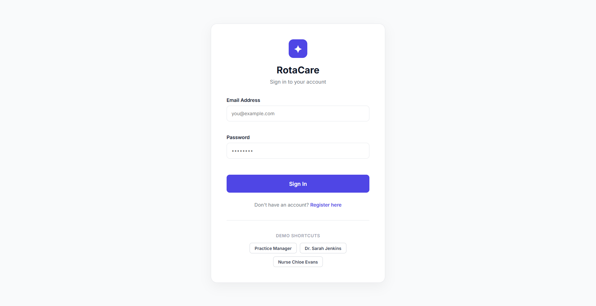

# RotaCare — Universal SaaS Scheduling Platform

A high-end, multi-tenant workforce scheduling application designed for modern clinical and private practices (Dental Clinics, Physiotherapy, Care Homes). RotaCare combines an advanced shift timeline with a dynamic semantic terminology engine, role-based portals, and an automated working-time compliance auditor.

**Live Demo:** [https://staff-rota-frontend.onrender.com](https://staff-rota-frontend.onrender.com)

---

<div align="center">
  
</div>

---

## ✨ Overview

RotaCare isn't just a spreadsheet replacement; it's a dynamic scheduling OS. Rather than forcing independent businesses into rigid hospital terminology, the system adapts directly to the client's industry via a **Universal Context Engine**. 

- **Role-Based Portals:** Managers get a powerful, collapsible command center. Practitioners get a clean, mobile-first personal agenda.
- **Dynamic Semantic Layout:** The entire application repaints its terminology instantly based on the active Industry Template (e.g., swapping "Locations" and "Staff" for "Chairs" and "Dentists").
- **Compliance Rules Engine:** Enforces 11-hour rest rules, 48-hour week caps, and grade-matching before any shift is published.
- **Live Deployed:** Backend (FastAPI + SQLite) on Render. Frontend (React + Vite) on Render Static Sites.

---

## 🚀 Core Features

### 1. Dynamic Terminology Engine
Built for multi-tenant scalability, the application dynamically updates all sidebar links, metric cards, and table headers based on the active **Industry Template**:
- **Dental Clinic:** Staff → Practitioners, Locations → Chairs
- **Care Home:** Staff → Carers, Locations → Units/Floors
- **Physiotherapy:** Staff → Therapists, Locations → Treatment Rooms

### 2. Dual Role-Based UX Architecture
<div align="center">
  
</div>

- **Practice Manager Console:** A full-scale Gantt timeline. To prevent "spreadsheet fatigue," the grid features **Smart Accordions** that instantly collapse any location with zero active shifts into a clean single-line header.
- **Practitioner Agenda Feed:** When a clinical staff member logs in, the heavy Gantt chart is bypassed entirely. They are presented with a beautiful, mobile-first vertical card feed showing exactly when and where they are working today.

### 3. Real-Time Compliance Auditor
Built to handle strict medical working time directives (like EWTD):
- **11-Hour Rest Rule:** Blocks consecutive shifts with less than 11 hours of rest between them.
- **Grade Hierarchy Enforcement:** Prevents junior staff from being assigned to shifts requiring senior consultant/lead grades.
- **Audit Trails & Overrides:** Managers can bypass soft warnings using mandatory reason codes (`EMERGENCY_OVERRIDE`), permanently logged to a dedicated audit trail.

### 4. Locum Pool & Swap Management
- **One-Click Agency Broadcasts:** Unassigned shifts can be flagged to the Locum/Agency pool instantly.
- **Shift Swap Board:** Staff can request shift swaps, and managers can approve them on a dedicated board (complete with compliance validation for the replacement staff).

---

## 🏗️ System Architecture

```text
Docker Compose
     │
     ├── backend (python:3.12-slim)
     │     │  FastAPI + SQLModel + Uvicorn
     │     │  Port: 8000
     │     ├── compliance.py   ← Automated rules engine
     │     ├── seed.py         ← Private Practice demo seeder
     │     └── SQLite DB (staffrota-data volume)
     │
     └── frontend (node:22-alpine)
           │  React + Vite + Custom RotaContext
           └── Port: 3000
```

---

## 📡 API Reference

| Method | Endpoint | Description |
|---|---|---|
| `GET` | `/health` | Service health check |
| `GET` | `/rota/seed` | Seed Private Practice demo data |
| `POST` | `/employees` | Create staff member |
| `GET` | `/employees` | List all staff |
| `DELETE` | `/employees/{id}` | Delete staff + cascade + audit log |
| `POST` | `/shifts` | Create shift |
| `GET` | `/shifts` | List all shifts |
| `DELETE` | `/shifts/{id}` | Delete shift |
| `POST` | `/assignments` | Assign staff (runs compliance check) |
| `GET` | `/audit-logs` | All compliance audit entries |
| `GET` | `/rota/week?date=` | 7-day structured rota view |
| `GET` | `/rota/export?date=` | Download weekly CSV schedule |

---

## 🛠️ Local Setup (Docker — Recommended)

```bash
git clone https://github.com/stokie2605/staff-rota.git
cd staff-rota
docker-compose up --build
```

- **Frontend Secure Portal:** http://localhost:3000
- **Backend API docs:** http://localhost:8000/docs

### Run Without Docker

```bash
# Backend
cd backend
pip install -r requirements.txt
python seed.py
uvicorn main:app --reload --port 8000

# Frontend (new terminal)
cd frontend
npm install
npm run dev
```

### Run Test Suite

```bash
cd backend
pytest -vv
```

**Test Results (11/11 passing):** Includes EWTD 11-hour rest validation, 48-hour caps, grade hierarchy enforcement, and swap board logic.

---

## Recent SaaS Upgrades
- **Secure Login Portal:** Implemented isolated routing based on Practice Manager vs. Staff roles.
- **Universal Context Terminology:** Added global `industryTemplate` state context to decouple UI language from static medical terms.
- **Smart Accordion Dashboard:** Rebuilt the Gantt renderer to automatically collapse empty locations, radically reducing UI clutter.
- **MySchedule Feed:** Introduced a mobile-first agenda view specifically designed for front-line practitioners.
