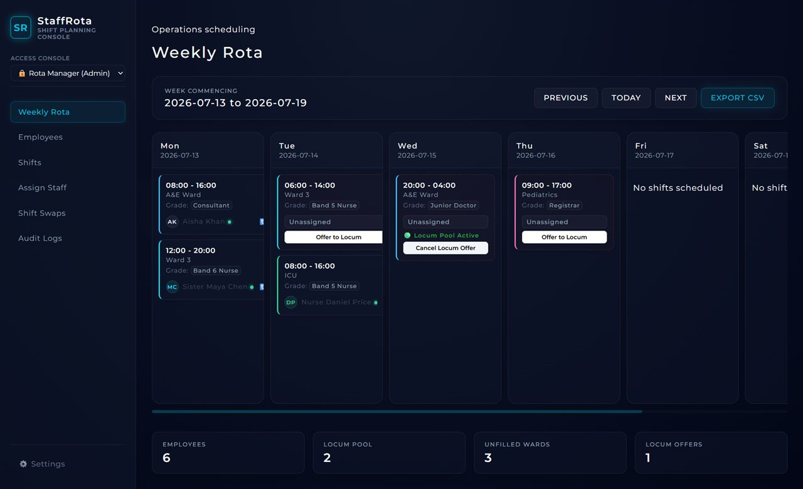

# StaffRota — NHS Shift Planning & Compliance Console

A full-stack, NHS-grade staff scheduling application with a real-time compliance rules engine, locum pool management, shift swap board, and a comprehensive audit trail.

**Live Demo:** [https://staff-rota-frontend.onrender.com](https://staff-rota-frontend.onrender.com)

---

<div align="center">
  
</div>

---

## 🏥 Overview

Built to handle NHS-level complexity. The scheduling engine enforces the **European Working Time Directive (EWTD)** automatically — catching 11-hour rest violations, 48-hour weekly hour caps, and clinical grade mismatches in real time before any shift assignment is saved.

- **Role-Based Access:** A role switcher allows Clinical Staff to view the rota read-only, while Rota Managers have full access to assign, override, and audit.
- **Glassmorphism UI:** A premium dark-mode interface built with frosted-glass panels, neon cyan accents, and Montserrat typography.
- **Live Deployed:** Backend (FastAPI + SQLite) on Render. Frontend (React + Vite) on Render Static Sites.

---

## ✅ Core Features

### NHS Compliance Rules Engine (`backend/compliance.py`)
- **11-Hour Rest Rule:** Blocks consecutive shift assignments with less than 11 hours between end and start times (handles midnight-crossing shifts correctly).
- **48-Hour Weekly Cap:** Audits a full Mon–Sun window and raises a warning if total assigned hours exceed 48.
- **Grade Hierarchy Enforcement:** Prevents clinical grade mismatches — nurses cannot cover doctor shifts; junior doctors cannot cover consultant shifts.
- **Override Justification:** Managers can bypass soft warnings with a mandatory reason code + 1-sentence justification, permanently logged to the audit trail.

### Locum Pool Management
- Unassigned shifts can be flagged **"Offer to Locum Pool"** with one click, broadcasting the shift to agency staff.
- Locum staff are tagged with amber indicators on all rota views and employee directories.
- Dashboard KPI cards track the live count of open locum offers and unfilled ward shifts.

### Shift Swap Board (`SwapPage.jsx`)
- Staff can post shift swap requests directly from the rota.
- Managers approve swaps on a dedicated board, with grade-filtered replacement staff dropdowns.
- Swap approvals run through the full compliance engine — a warning override is required if the replacement would violate EWTD.

### Compliance Audit Logs
- Every assignment, deletion, override, and swap is permanently logged.
- Audit entries display the **action type**, **reason code** (e.g. `EMERGENCY_OVERRIDE`, `SICKNESS_COVER`), and the manager's **override justification string**.

---

## 🏗️ System Architecture

```text
Docker Compose
     │
     ├── backend (python:3.12-slim)
     │     │  FastAPI + SQLModel + Uvicorn
     │     │  Port: 8000
     │     ├── compliance.py   ← NHS EWTD rules engine
     │     ├── seed.py         ← NHS demo data seeder
     │     └── SQLite DB (staffrota-data volume)
     │
     └── frontend (node:22-alpine)
           │  React + Vite
           └── Port: 3000
```

---

## 📡 API Reference

| Method | Endpoint | Description |
|---|---|---|
| `GET` | `/health` | Service health check |
| `GET` | `/rota/seed` | Seed NHS demo data via HTTP |
| `POST` | `/employees` | Create employee |
| `GET` | `/employees` | List all employees |
| `DELETE` | `/employees/{id}` | Delete employee + cascade + audit log |
| `POST` | `/shifts` | Create shift |
| `GET` | `/shifts` | List all shifts |
| `DELETE` | `/shifts/{id}` | Delete shift |
| `POST` | `/shifts/{id}/locum-pool` | Toggle locum pool offer |
| `POST` | `/assignments` | Assign employee (runs compliance check) |
| `GET` | `/assignments` | List all assignments |
| `DELETE` | `/assignments/{id}` | Remove assignment + audit log |
| `GET` | `/assignments/swap-requests` | List pending swap requests |
| `POST` | `/assignments/swap-request` | Post a swap request |
| `POST` | `/assignments/swap-request/{id}/approve` | Approve a swap |
| `GET` | `/audit-logs` | All compliance audit entries |
| `GET` | `/rota/week?date=` | 7-day structured rota view |
| `GET` | `/rota/export?date=` | Download weekly CSV rota |

---

## 🗄️ Data Models

```text
Employee          id, name, role, department, grade, is_locum
Shift             id, date, start_time, end_time, location, required_grade, offered_to_locum_pool
ShiftAssignment   id, employee_id (FK), shift_id (FK), shift_date, shift_slot
                  UNIQUE CONSTRAINT (employee_id, shift_date)
ShiftSwapRequest  id, requesting_employee_id, shift_id, target_employee_id, status
AuditLog          id, timestamp, action, performed_by, details, reason_code, override_justification
```

---

## 🛠️ Local Setup (Docker — Recommended)

```bash
git clone https://github.com/stokie2605/staff-rota.git
cd staff-rota
docker-compose up --build
```

- **Frontend:** http://localhost:3000
- **Backend API docs:** http://localhost:8000/docs

### Run Without Docker

```bash
# Backend
cd backend
pip install -r requirements.txt
python seed.py
uvicorn main:app --reload --port 8000

# Frontend (new terminal)
cd frontend
npm install
npm run dev
```

### Run Test Suite

```bash
cd backend
pytest -vv
```

**Test Results (11/11 passing):**
- `test_check_11hr_rest_compliance` ✅
- `test_check_48hr_weekly_compliance` ✅
- `test_check_grade_compliance` ✅
- `test_create_employee` ✅
- `test_create_shift_and_conflict` ✅
- `test_export_rota_csv` ✅
- `test_assignment_grade_mismatch` ✅
- `test_assignment_compliance_warning_and_override` ✅
- `test_shift_swap_workflow` ✅

---

## NHS Grade / Band Mapping

| Category | Grades Supported |
|---|---|
| Nursing Staff | Band 5 Nurse (Staff Nurse), Band 6 Nurse (Senior/Sister) |
| Medical Staff | Junior Doctor, Registrar, Consultant |
| Agency / Locum | Any grade, flagged with amber indicator |

---

## Recent Upgrades

- **NHS EWTD Compliance Engine:** 11-hour rest, 48-hour weekly cap, and grade hierarchy validation.
- **Locum Pool Management:** One-click locum broadcasts with live KPI tracking.
- **Shift Swap Board:** Full swap request and approval workflow with compliance checks.
- **Role-Based Access:** Clinical Staff (read-only) and Rota Manager (full control) modes.
- **Glassmorphism Dashboard:** Complete dark-mode UI redesign with frosted glass panels, neon accents, and Montserrat typography.
- **Live Deployment:** Fully deployed on Render — frontend static site + Dockerised backend.
