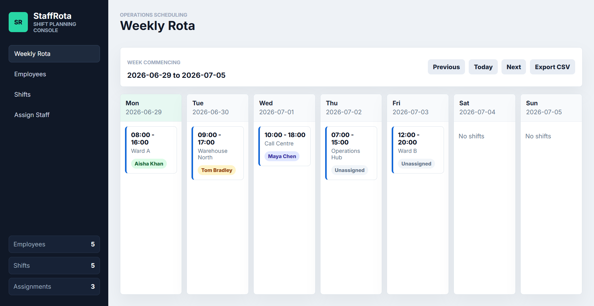

# Staff Rota — Shift Scheduling & Operations Platform
> **The 1-Line Mission:** Backend-driven Docker-containerized staff scheduling system enforcing shift conflict prevention, compliance audit trails, and one-click CSV rota exports for teams.

### ⚡ Engineering Breakdown
* **The Problem:** Managing staff shift assignments across departments manually produces scheduling conflicts, missing compliance records, and time-consuming rota distribution — especially for 24/7 teams like hospital wards, call centres, and logistics warehouses.
* **The Solution:** A FastAPI/SQLModel REST backend enforcing database-level double-booking prevention via a `UNIQUE (employee_id, shift_date)` constraint, backed by a React SPA frontend with a 7-day rota grid, real-time sidebar stats, and CSV export logic — all containerized with Docker Compose for one-command local deployment.
* **The Tech Stack:** `FastAPI` `SQLModel` `SQLite` `React` `Vite` `Docker Compose` `pytest`

---

## 🎥 Visual Preview

<div align="center">
  
</div>

---

## 🏗️ System Architecture

```
Docker Compose
     │
     ├── backend (python:3.12-slim)
     │     │  FastAPI + SQLModel + Uvicorn
     │     │  Port: 8000
     │     └── SQLite DB (staffrota-data volume)
     │
     └── frontend (node:22-alpine)
           │  React + Vite dev server
           └── Port: 3000
```

---

## ⚙️ Core Business Logic

### Double-Booking Prevention
A database-level `UniqueConstraint` on `(employee_id, shift_date)` ensures a single employee can only be assigned to one shift per day. Attempting a second assignment returns **409 Conflict**:

```python
class ShiftAssignment(SQLModel, table=True):
    id: Optional[int] = Field(default=None, primary_key=True)
    employee_id: int = Field(foreign_key="employee.id")
    shift_id:    int = Field(foreign_key="shift.id")
    shift_date:  str = Field(index=True)   # denormalised from Shift.date
    shift_slot:  str                       # e.g. "08:00-16:00"

    __table_args__ = (
        UniqueConstraint("employee_id", "shift_date", name="uix_employee_shift_date"),
    )
```

### Weekly Rota View (`GET /rota/week?date=YYYY-MM-DD`)
Calculates Monday–Sunday bounds for any date and returns a 7-day structured JSON response with all shifts and assigned staff per day — consumed by the frontend calendar grid.

### CSV Export (`GET /rota/export?date=YYYY-MM-DD`)
Streams a downloadable `.csv` file with columns `Date, Day, Start, End, Location, Employee, Role, Department`. Unassigned shifts are included as blank employee rows.

### Compliance Audit Log
All destructive admin actions (`EMPLOYEE_DELETED`, `ASSIGNMENT_DELETED`) are logged to the `audit_logs` table with a timestamp, actor, and description for compliance traceability.

---

## 📡 API Reference

| Method | Endpoint | Description |
|---|---|---|
| `GET` | `/health` | Service health check |
| `POST` | `/employees` | Create employee |
| `GET` | `/employees` | List all employees |
| `DELETE` | `/employees/{id}` | Delete employee + cascade + audit log |
| `POST` | `/shifts` | Create shift |
| `GET` | `/shifts` | List all shifts |
| `DELETE` | `/shifts/{id}` | Delete shift + cascade assignments |
| `POST` | `/assignments` | Assign employee to shift (409 on conflict) |
| `GET` | `/assignments` | List all assignments |
| `DELETE` | `/assignments/{id}` | Remove assignment + audit log |
| `GET` | `/audit-logs` | All compliance audit entries |
| `GET` | `/rota/week?date=` | 7-day structured rota view |
| `GET` | `/rota/export?date=` | Download weekly CSV rota |

---

## 🗄️ Data Models

```
Employee       id, name, role, department
Shift          id, date, start_time, end_time, location
ShiftAssignment id, employee_id (FK), shift_id (FK), shift_date, shift_slot
               UNIQUE CONSTRAINT (employee_id, shift_date)
AuditLog       id, timestamp, action, performed_by, details
```

---

## 🛠️ Local Setup (Docker — Recommended)

```bash
docker-compose up --build
```
- **Frontend:** http://localhost:3000
- **Backend API docs:** http://localhost:8000/docs

### Run Backend Tests Locally
```bash
cd backend
pip install -r requirements.txt -r requirements-dev.txt
pytest -vv
```

### Seed Demo Data
```bash
cd backend
python seed.py
```
Populates 5 employees, 5 shifts across the current week, and 3 pre-made assignments.


## Recent Architectural Upgrades
- **Structural Hygiene:** Reorganized the repository into distinct `src/`, `backend/`, and `tests/` directories.
- **Security Enhancements:** Implemented constant-time cryptographic token verification to prevent timing attacks.
- **Database Schema Upgrades:** Refactored primitive types into native data structures (e.g., Dates and Times) for robust ORM integration.
- **Code Hygiene:** Eradicated dead code, legacy logs, and enforced strict linting/testing standards.
